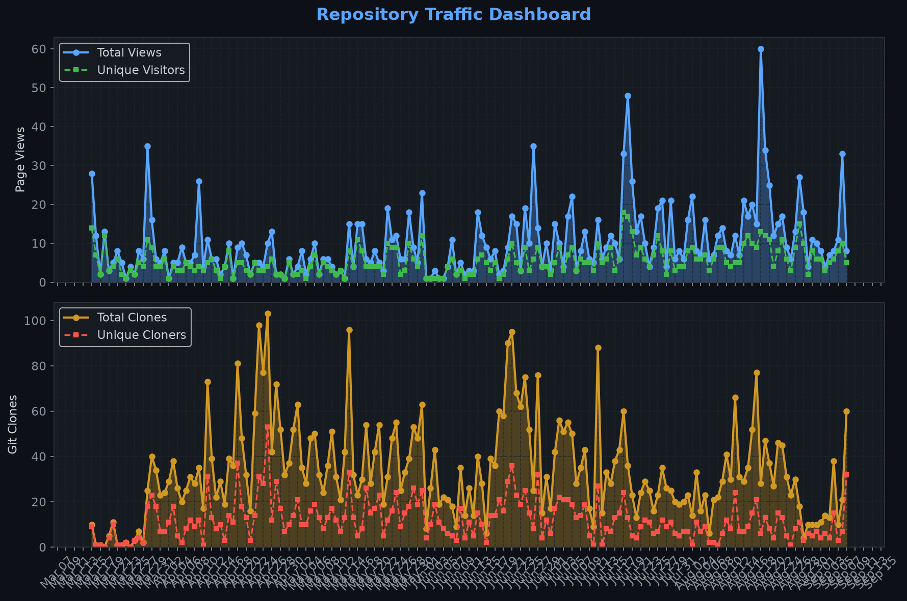
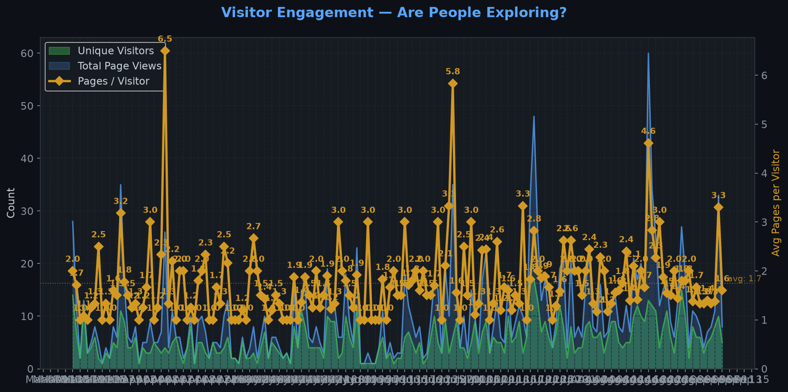
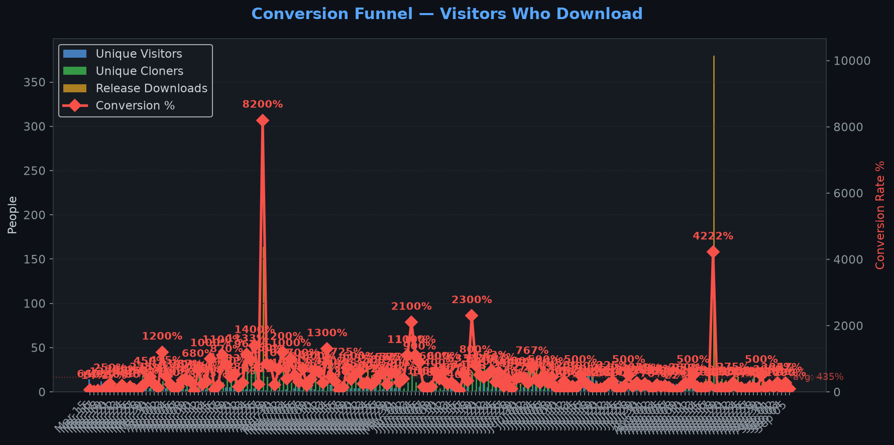
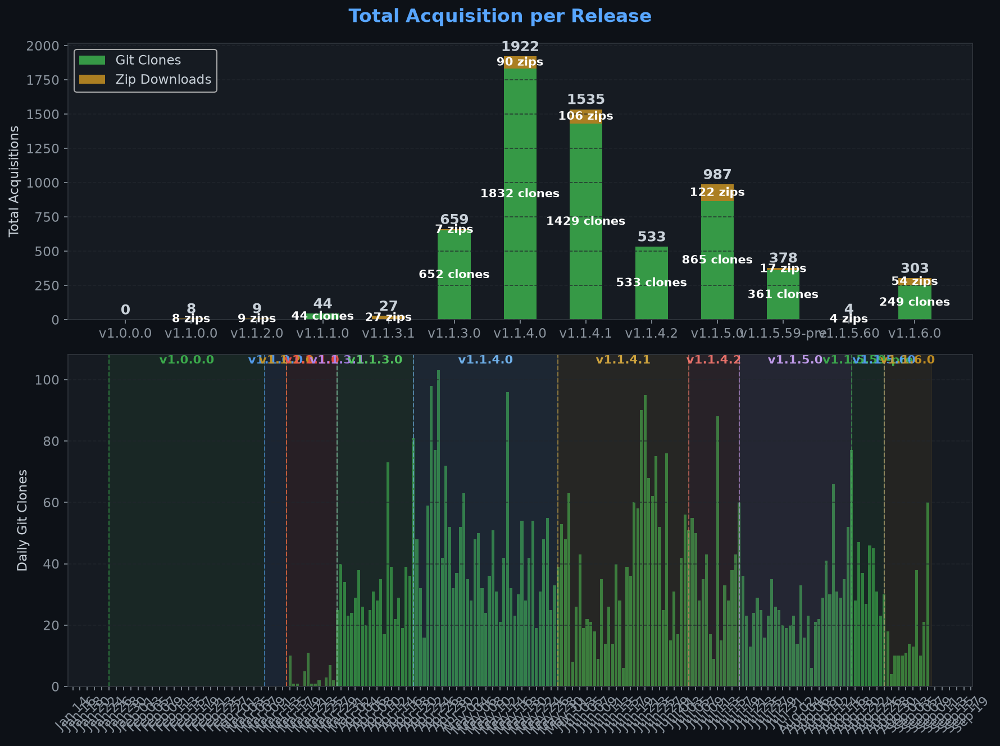
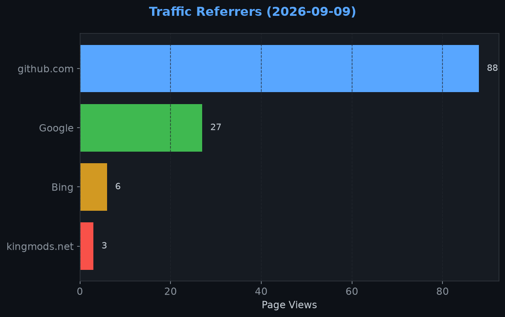
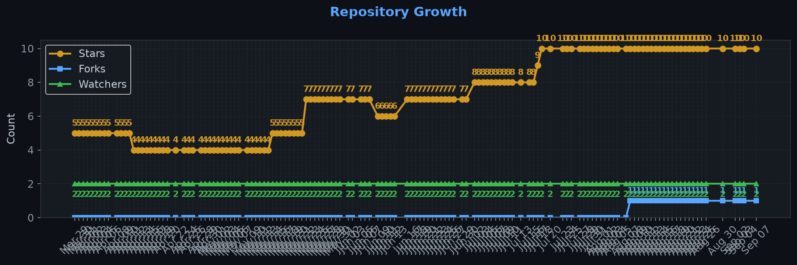

# Repository Traffic Dashboard

**Last updated:** 2026-09-09T12:41:37Z
**Days tracked:** 138 | **Download snapshots:** 544 (hourly)

---

## Views & Clones (14-day window, preserved forever)

| Metric | 14-Day Total | Unique |
|--------|-------------|--------|
| Page Views | 168 | 83 |
| Git Clones | 272 | 94 |

> **Engagement:** 2.0 pages per visitor (14-day avg)

---

## Visitor Engagement

> Higher = visitors exploring more pages. 1.0 = bounce. 3.0+ = deeply engaged.

---

## Conversion Funnel

> **14-day conversion:** 538 of 83 visitors cloned or downloaded (**648.1%**)
>
> Unique cloners: 94 | Release downloads: 444

---

## Total Acquisition per Release (Downloads + Clones)

| Channel | Count |
|---------|-------|
| Zip Downloads | 444 |
| Git Clones (14-day) | 272 |
| **Total Acquisitions** | **716** |

---

## Referrers

| Source | Views | Unique |
|--------|-------|--------|
| github.com | 88 | 48 |
| Google | 27 | 18 |
| Bing | 6 | 1 |
| kingmods.net | 3 | 3 |

---

## Repository Growth

| Metric | Current |
|--------|---------|
| Stars | 10 |
| Forks | 1 |
| Watchers | 2 |

---

## Top Pages (14-day)

| Page | Views | Unique |
|------|-------|--------|
| `/Realistic-Farming/FS25_TaxMod` | 96 | 76 |
| `/Realistic-Farming/FS25_TaxMod/releases/tag/v1.1.6.0` | 30 | 27 |
| `/Realistic-Farming/FS25_TaxMod/releases` | 10 | 8 |
| `/Realistic-Farming/FS25_TaxMod/tree/development` | 3 | 1 |
| `/Realistic-Farming/FS25_TaxMod/blob/main/TODO.md` | 2 | 2 |
| `/Realistic-Farming/FS25_TaxMod/pull/22` | 2 | 2 |
| `/Realistic-Farming/FS25_TaxMod/pull/28` | 2 | 2 |
| `/Realistic-Farming/FS25_TaxMod/pulls` | 2 | 2 |
| `/Realistic-Farming/FS25_TaxMod/releases/tag/v1.1.5.0` | 2 | 2 |
| `/Realistic-Farming/FS25_TaxMod/releases/tag/v1.1.5.60` | 2 | 2 |

---

## Data Files

| File | Description | Granularity |
|------|-------------|-------------|
| [daily.json](daily.json) | Views & clones per day (never expires) | Daily |
| [downloads.json](downloads.json) | Release download snapshots | Hourly |
| [referrers.json](referrers.json) | Referrer snapshots | Daily |
| [metadata.json](metadata.json) | Stars, forks, watchers | Daily |
| [stats.json](stats.json) | Combined legacy snapshots | 6-hourly |

---
*Hourly download tracking + full dashboard with engagement metrics every 6 hours*
*Auto-generated by [traffic-stats.yml](../../.github/workflows/traffic-stats.yml)*
